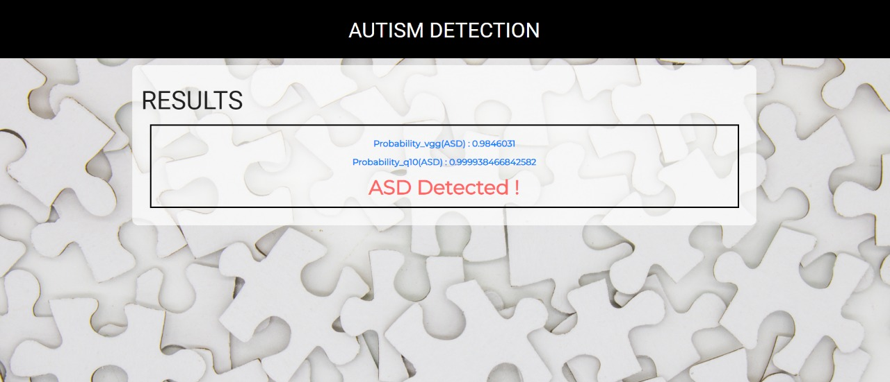

# AI Entrepre-Neural Submission

## *AUTISMO Autism Spectrum Detection for Toddlers using openVINO*

A simple application to detect Autism Spectrum Disorder(ASD) in toddlers using images of their faces and the standard [Q-chat-10(Quantitative Checklist for Autism in Toddlers)](https://www.autismalert.org/uploads/PDF/SCREENING--AUTISM--QCHAT-10%20Question%20Autism%20Survey%20for%20Toddlers.pdf) Test

# Live App:

The app is hosted at https://autism-detection.herokuapp.com

# Project Overview

In present day Autism Spectrum Disorder (ASD) is gaining its momentum faster than ever. Detecting autism traits
through screening tests is very expensive and time consuming. With the advancement of artificial intelligence
and machine learning (ML), autism can be predicted at quite an early stage.

Though a number of studies have been carried out using different techniques, these studies didn't provide any
definitive conclusion about predicting autism traits in terms of different age groups. Therefore our project aims
to propose an effective prediction model based on ML and DL techniques and to develop a Web application for
predicting ASD for people of early ages.

Autism Spectrum Disorder (ASD) is a neuro disorder inwhich a person has a lifelong effect on interaction and communication with others. Autism can be diagnosed at any stage in one life and is said to be a "behavioral disease" because in the first two years of life symptoms usually appear.

# Model Training:

## [Dataset Link](https://www.kaggle.com/gpiosenka/autistic-children-data-set-traintestvalidate/version/5)

For training we fine-tuned the VGG-Face Model by freezing all the layers except the last 30 layers. 
Pre trained Model of VGGFace trained on the dataset, SqueezeNet ResNet 50 model (called SE ResNet 50 or SENet) is used 

## Architecture

1. The model is based on VGG Face , Oxford’s deep facial
recognition.
2. 2 dense layers are applied on top of Base Model along with SoftMax Classifier. All the layers were froze other than top 30 layers to be trainable on Kaggle’s Autism Dataset.

## Fine Tuning

The models are fine tuned on the same Kaggle dataset of 2897 labeled images. The data set has an age distribution
of approximately 2 years to 14 years, with majority of the pictures between ages 2 years to 8 years. The gender ratio
in Autistic class is 3:1 (Male: Female) and in Non Autistic it’s close to 1:1 (which are close to their respective populations). The ratio of white children to children of color is 10:1

## OpenVino Inference 

OpenVino Inference Model Optimizer of OpenVino Toolkit produces an
Intermediate Representation (IR) of the network, which can be read, loaded, and inferred with the Inference Engine.

Model Optimizer is a cross platform command line tool that facilitates the transition between the training and deployment environment, and adjusts deep learning models for optimal execution on end point target devices.

We have used OpenVino in Google Colab. There was a significant improvement of inference time when we used OpenVino 

Total time required for inferencing ,without using OpenVino : 61.770 s 
Total time required for inferencing ,by using OpenVino : 45.764 s

Hence, time taken for a single image after inference using OpenVino is 0.152 s0

# Softwares and Libraries used

1. Google Colab
2. Keras
3. Tensorflow
4. Tensorflow lite
5. OpenCV
6. OpenVINO Toolkit
7. Flask
8. Heroku

# Steps to Run it locally:

## Prerequisites:

Make sure you have Python 3.7 or higher installed on your system to run the application. 
Also install venv library to install the dependencies in a virtual environment using the command:
pip install venv

## Steps

1. Download the Repo.
2. cd to the Repo.
3. create a virtual Environment as follows:
`virtualenv autism-detection`

4. Activate the virtual environment:
	For windows:
	`autism-detection\Scrips\activate`
	For Mac/Linux:
	`source autism-detection/bin/activate`

5. Now install all the dependencies:
`pip install -r requirements.txt` 

6. Once all the dependencies are installed run the app.
`python main.py`

And then open any browser and type in localhost:5000 or 127.0.0.1:5000.

# Future Enhancements:

1. Here we have 2 different datasets and two different models to detect ASD and we have taken the weighted average of the individual probabilites to compute the final result. A better approach would be to train a models to detect ASD if a single dataset contains both images and Q-CHAT-10 data of toddlers.
2. Enhancing face detection algorithms in case the images are hazy or noisy.
3. In cases of multiple faces in the input image, using age detection algorithms to select the one face closest to that of a toddler.

# Contributors:

1. [Shreyasi Roy Chowdhury](https://github.com/shreyasirc)
2. [Sayani Dutta](https://github.com/sayanidutta2345)
3. [Susmita Mazumdar](https://github.com/susmita2000)
4. [Shivam Shrivastava](https://github.com/shivamshrivastava2000)
5. [Smayan Das](https://github.com/SmayanD99)
